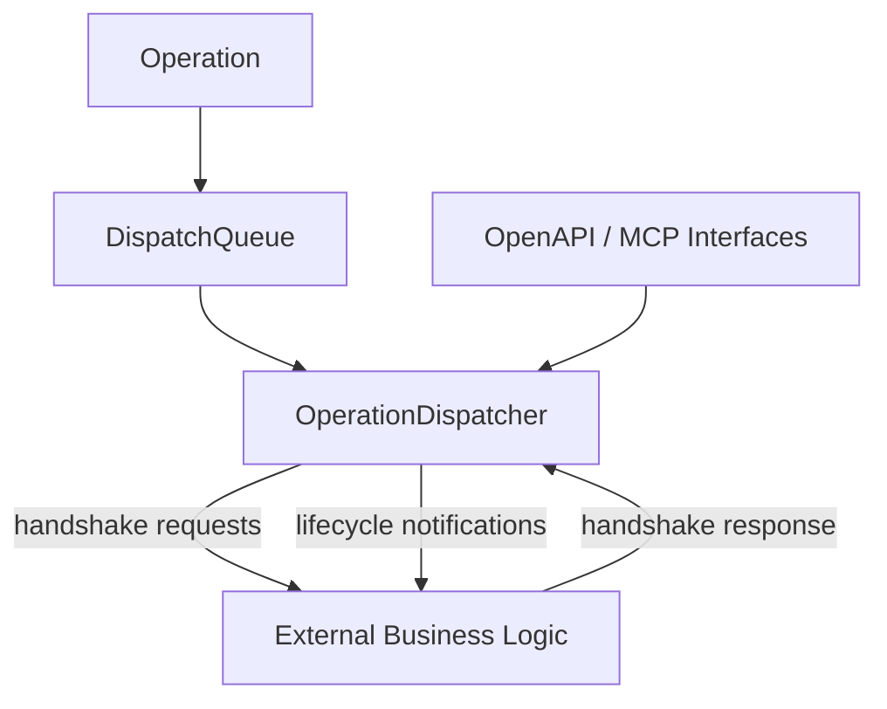

# Operation Dispatcher

Operation Dispatcher is a lightweight Python framework for queueing, dispatching, and supervising operations for a single resource such as a robot, machine, workstation, or transport vehicle.

Typical workflow:

1. Queue transport operations for a mobile robot
2. Wait until release conditions are satisfied
3. Request permission to start execution
4. Approve or deny execution through external business logic
5. Emit lifecycle events during execution

## Highlights

- Queue operations for robots, machines, or workstations
- Async-friendly dispatcher runtime
- Explicit request/approval lifecycle handshakes
- Runtime lifecycle orchestration
- Operation execution tracking and history
- Built-in retry and cooldown policies
- Callback-based integration with external systems (datastores, event streams, control logic)
- OpenAPI + Swagger integration
- MCP server integration for AI/LLM agents


## Architecture



## Installation

Base package:

```bash
pip install -e .
```

With tests/dev tools:

```bash
pip install -e .[dev]
```

With Flask + Flasgger API extras:

```bash
pip install -e .[api]
```

With Plotly visualization extras:

```bash
pip install -e .[vis]
```

## Quickstart

```python
import asyncio
from operation_dispatcher import (
    OperationDispatcher,
    Operation,
    DispatchEvent,
    EventType,
)

def on_request(event: DispatchEvent) -> bool | None:
	# Decide on a *_REQUEST event.
	# Return True to approve, False to deny, None to ignore other events.

    if event.event_type is EventType.OPERATION_START_REQUESTED:
        return True
    return None


def on_notification(event: DispatchEvent) -> None:
    # Observe all lifecycle and state change events.
    # Typical use cases: logging, persistence, event streaming.
	print(f"{event.event_type} -> resource={event.resource_id} operation={event.operation_id}")


async def main():
    dispatcher = OperationDispatcher(
        resource_id="robot-1",
        on_request_callback=on_request,
        on_notification_callback=on_notification,
    )

    dispatcher.add(
        Operation(
            payload={"task": "pickup"},
            resource_id="robot-1",
            priority=10,
        )
    )

    task = asyncio.create_task(dispatcher.run())
    await asyncio.sleep(2)
    dispatcher.request_stop()
    await task

asyncio.run(main())
```


## Core Data Models

- `Operation`: Represents a queued operation with payload, priority, and scheduling metadata.
- `OperationExecution`: Runtime state of a scheduled operation (running, paused, completed, failed).
- `DispatchEvent`: Event emitted during lifecycle transitions and request/notification flows, including the dispatcher `resource_id`.

## Dispatcher Runtime

The `OperationDispatcher` runs a continuous loop that manages queued operations and their lifecycle.

Each iteration performs:

1. Check for paused state or active execution
2. Select next eligible operation from the queue
3. Evaluate release and retry conditions
4. Emit a request event to external logic
5. Wait for approval or denial
6. Start execution if approved
7. Emit lifecycle events during execution

### Key concept

The dispatcher does not execute operations directly. Instead, it delegates execution decisions via request callbacks, allowing external systems to control behavior dynamically.


## Default OpenAPI Endpoints

#### Operations

- `GET /operations` (`state` query parameter optional: `QUEUED`, `RUNNING`, `PAUSED`, `COMPLETED`, `FAILED`, `CANCELLED`)
- `GET /operations/current`
- `GET /operations/history` (`limit` query parameter, default `50`, min `1`, max `1000`)
- `GET /operations/<operation_id>`
- `GET /operations/<operation_id>/events`
- `POST /operations/add` (request body is a non-empty list of operation objects)
- `POST /operations/<operation_id>/cancel`
- `POST /operations/<operation_id>/pause`
- `POST /operations/<operation_id>/resume`

#### Dispatcher Runtime

- `GET /dispatcher`
- `POST /dispatcher/start`
- `POST /dispatcher/stop`
- `POST /dispatcher/pause`
- `POST /dispatcher/resume`


## Event Types

`DispatchEvent` instances are emitted for runtime lifecycle, request handshakes, and operation lifecycle transitions.

### Dispatcher lifecycle events

- `OPERATION_DISPATCHER_STARTED`: emitted when `run()` enters its main loop.
- `OPERATION_DISPATCHER_STOPPED`: emitted when the runtime loop exits and dispatcher state is cleaned up.
- `OPERATION_DISPATCHER_PAUSED`: emitted when the dispatcher is paused manually or after too many denied retries.
- `OPERATION_DISPATCHER_RESUMED`: emitted when dispatcher runtime is resumed.

### Request events

- `OPERATION_START_REQUESTED`: asks whether the next queued operation may begin.
- `OPERATION_START_DENIED`: indicates that a start request was denied; event metadata includes retry information and optionally the denial reason.
- `OPERATION_CANCEL_REQUESTED`: asks whether a queued or active operation may be cancelled.
- `OPERATION_CANCEL_DENIED`: indicates that a cancel request was denied.
- `OPERATION_PAUSE_REQUESTED`: asks whether the current active operation may be paused.
- `OPERATION_PAUSE_DENIED`: indicates that a pause request was denied.
- `OPERATION_RESUME_REQUESTED`: asks whether the current paused operation may resume.
- `OPERATION_RESUME_DENIED`: indicates that a resume request was denied.

### Operation lifecycle events

- `OPERATION_ADDED`: emitted when a scheduled operation is inserted into the queue and execution tracking is created.
- `OPERATION_STARTED`: emitted after the operation is pulled from the queue and marked running.
- `OPERATION_COMPLETED`: emitted when the current operation finishes successfully.
- `OPERATION_FAILED`: emitted when the current operation is marked failed because of an internal failure path.
- `OPERATION_PAUSED`: emitted when the current operation is paused after a successful pause request.
- `OPERATION_RESUMED`: emitted when the current operation is resumed after a successful resume request.
- `OPERATION_CANCELLED`: emitted when an operation is cancelled, whether it was still queued or already active.

### How to interpret them

- `*_REQUESTED` events are the handshake points where business logic decides whether the dispatcher may proceed.
- dispatcher lifecycle events are emitted when the state of the operation dispatcher is changing.
- operation lifecycle events describe what happened to a specific scheduled operation.


## Examples

- Queue-only example:

```bash
python examples/dispatch_queue.py
```

- Dispatcher callback/runtime example:

```bash
python examples/dispatcher.py
```

- Dispatcher visualization demo:

```bash
python examples/dispatcher_visualization.py
```

- History Gantt visualization:

```python
from operation_dispatcher import show_history_gantt

history = dispatcher.get_history()
show_history_gantt(history, title="Dispatcher History")
```

- Flask + OpenAPI demo:

```bash
python examples/dispatcher_openapi.py
```

Then open:

- http://localhost:8000/
- http://localhost:8000/openapi.json
- http://localhost:8765/

- MCP server demo:

```bash
python examples/dispatcher_mcp.py
```

- Dual interface demo (OpenAPI + MCP + visualization):

```bash
python examples/dispatcher_dual_interface.py
```

